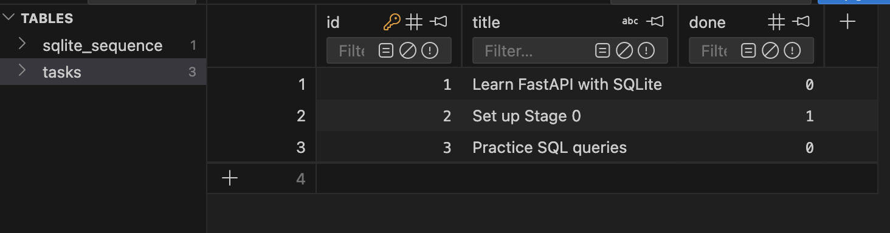

# Task CRUD API — SQLite

A task management API (FastAPI + SQLite) — the second stage of the same project, upgrading storage from an in-memory list (A1) to a real database file that survives restarts.

**This folder is the final, standalone A2 submission.** It is intentionally frozen at this stage — the later Postgres/Docker upgrade (A3) lives in a separate folder, [`../be-03-containerize-stack/`](../be-03-containerize-stack/), so this SQLite version stays checkable on its own.

## Why SQLite?

SQLite was chosen because it requires zero setup, runs entirely from a single file, and allows data to survive server restarts. It's fast and well suited to a straightforward backend application without needing a standalone database server.

## Where the database file lives

`tasks.db`, inside this folder. It's created automatically the first time the app runs — nothing to set up by hand. It's git-ignored, so each clone starts with a fresh, empty-then-auto-seeded database.

## Running it

```bash
cd be-02-connect-database
python3 -m venv venv
source venv/bin/activate
pip install -r requirements.txt
uvicorn main:app --reload
```

The server runs at `http://127.0.0.1:8000`. On first run, `tasks.db` is created automatically with the `tasks` table and 3 seeded example tasks.

## Endpoints

| Method | Path | Description | Success | Errors |
|---|---|---|---|---|
| GET | `/tasks` | List all tasks | 200 | — |
| GET | `/tasks/{id}` | Get one task by id | 200 | 404 if not found |
| POST | `/tasks` | Create a task | 201 | 400 if title empty |
| PUT | `/tasks/{id}` | Update a task's title/done | 200 | 400 if title empty, 404 if not found |
| DELETE | `/tasks/{id}` | Delete a task | 204 | 404 if not found |

Identical endpoints, request/response shapes, and status codes as A1 — only the storage underneath changed, from an in-memory list to `tasks.db`.

## Exploring the database directly (Stage 4)

Opened `tasks.db` in [DB Browser for SQLite](https://sqlitebrowser.org/) and ran queries by hand against the same file the API reads from — no syncing, one source of truth.

**Example query:**
```sql
SELECT * FROM tasks WHERE done = 1;
```
*Returns only the tasks that have been marked as completed (`done = 1`).*

## Database screenshot



## Persistence

Create a task, stop the server, start it again, `GET /tasks` — the task is still there. That's the entire point of this assignment: swapping memory for a database file that outlives the running program.

## Stage 6: AI vs Me (The AI Rematch)

The AI's version of this same SQLite migration lives in [`./ai-version/`](./ai-version/) — a separate folder, never touching this one.

**Prompt given to AI:**
> Write a FastAPI CRUD API using sqlite3. Create table `tasks` (id integer primary key, title text, done integer) if missing. Seed 3 tasks only when empty. 5 endpoints (GET /tasks, GET /tasks/{id}, POST /tasks, PUT /tasks/{id}, DELETE /tasks/{id}) identical to in-memory, 400/404 rules, and parameterized queries.

### Differences (AI vs Me)

1. **Better parameter binding**: The AI used `conn.row_factory = sqlite3.Row`, which made reading from the database automatically convert to dictionaries, while my manual code used tuple unpacking to construct the dictionaries.
2. **Missing Lifespan Manager**: The AI put the database initialization `init_db()` loosely at the module level instead of putting it safely in an `@asynccontextmanager` lifespan event like I did.
3. **Implicit boolean casting**: My manual implementation explicitly cast `done` using `bool(done)` when sending it back to the user, and converted it correctly on `PUT`. The AI simply passed the integer value `0` or `1`, which meant the response shape returned `done: 0` instead of `done: false`.
4. **Validation differences**: The AI manually checked `c.rowcount == 0` for `PUT` and `DELETE` requests to return a `404`, whereas I ran an explicit `SELECT id FROM tasks` query to check if the task existed before running the update or delete operation. Both work, but checking `rowcount` is a clever and slightly more efficient shortcut.
