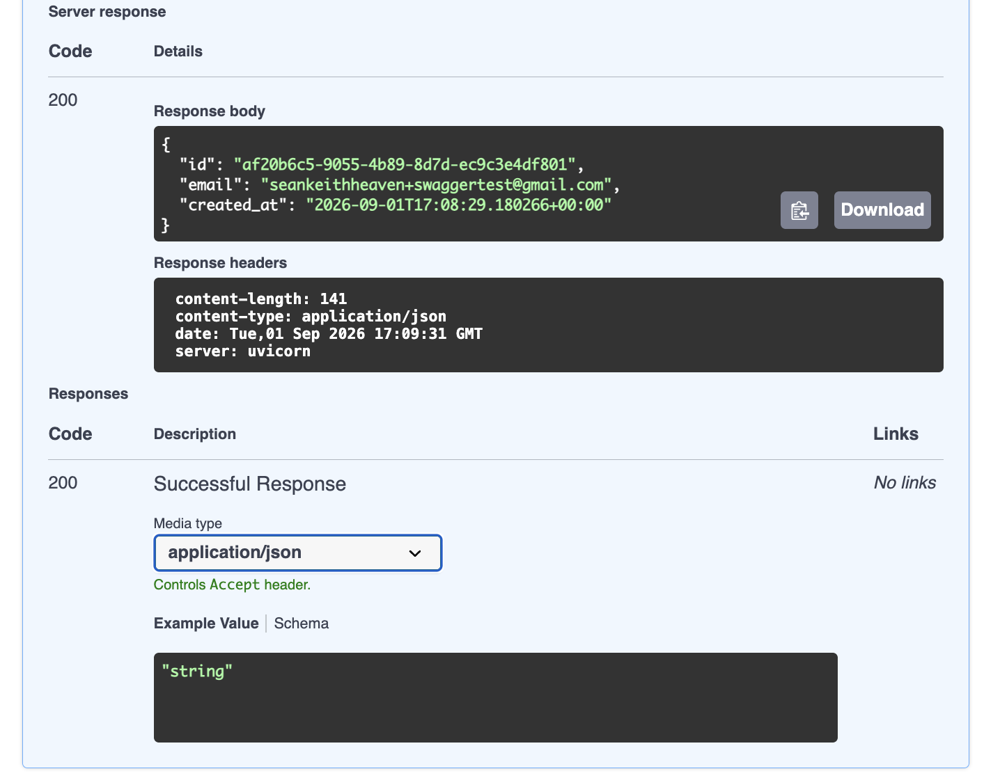

# Auth API — Supabase, JWT verification, protected routes

A secure API built with FastAPI and **Supabase Auth** as the Identity Provider — sign up, log in, log out, and a reusable guard that protects specific routes behind a verified JSON Web Token (JWT).

**This is a standalone project, separate from the tasks CRUD API** (`be-01`/`be-02`/`be-03`). It doesn't touch tasks or ownership — it's purely about telling registered users apart from strangers.

Supabase handles everything sensitive: it stores accounts, hashes passwords, and signs tokens. This project never writes cryptography or password hashing itself — its job is narrower: receive a token, ask Supabase "is this real?", and open or refuse the door based on the answer.

## Setup

You need your own free Supabase project — this repo never contains any real Supabase credentials.

1. Create a free project at [supabase.com](https://supabase.com)
2. In **Project Settings → API**, copy your **Project URL** and **anon key** (never the `service_role` key)
3. In **Authentication → Sign In / Providers → Email**, turn off **"Confirm email"** (so signups can log in immediately, without needing to click a confirmation link — fine for local testing, not for production)
4. Copy `.env.example` to `.env` and fill in your real values:

```bash
cp .env.example .env
```

```
SUPABASE_URL=your_project_url
SUPABASE_ANON_KEY=your_anon_key
PORT=8000
```

## Running it

```bash
python3 -m venv venv
source venv/bin/activate
pip install -r requirements.txt
python main.py
```

The server runs at `http://localhost:8000`. Interactive API docs (Swagger UI) are automatically available at `http://localhost:8000/docs`.

## Endpoints

| Method | Path | Purpose | Auth required |
|---|---|---|---|
| POST | `/auth/signup` | Create a new account | No |
| POST | `/auth/login` | Log in, returns an access token + refresh token | No |
| POST | `/auth/logout` | End the current session | Yes — `Authorization: Bearer <token>` |
| GET | `/public/info` | Open, unauthenticated data | No |
| GET | `/protected/profile` | Read the logged-in user's own profile | Yes — `Authorization: Bearer <token>` |
| GET | `/protected/dashboard` | A second protected route, reusing the same guard | Yes — `Authorization: Bearer <token>` |

**Status codes:** `201` signup success · `200` login/read success · `204` logout success · `400` missing email/password · `401` missing, malformed, invalid, or expired token / bad login credentials.

## Example request

```
$ curl -i -X POST http://localhost:8000/auth/signup \
    -H "Content-Type: application/json" \
    -d '{"email":"you@example.com","password":"yourpassword"}'

HTTP/1.1 201 Created
content-type: application/json

{"id": "...", "email": "you@example.com", ...}
```

## How the guard works

Every protected route depends on one reusable function, `get_current_user`, via FastAPI's `Depends(...)`:

1. It extracts the bearer token from the `Authorization` header (using FastAPI's `HTTPBearer` security scheme — this is also what makes the lock icon show up in Swagger UI)
2. It calls `supabase.auth.get_user(token)` — a real network request to Supabase, not just a local check — to confirm the token is genuine
3. If Supabase rejects it, the route returns `401` before its own body ever runs
4. If it's valid, the verified user is handed to the route as a parameter — the route itself never has to think about tokens at all

Adding a new protected route is as simple as adding `user = Depends(get_current_user)` to its signature — no new auth code required, proven by `/protected/dashboard` reusing the exact same guard as `/protected/profile`.

## Swagger UI with bearer auth

`/docs` shows a lock icon next to every protected route. Clicking **Authorize** and pasting a token lets you call protected routes directly from the browser, no `curl` needed.



## A real finding: logout and token reuse

JWTs are normally *stateless* — a server can't reach into a client and delete a token it already issued, so in theory a token should keep working until it naturally expires, even after "logout." Testing this directly: logging out, then reusing the exact same access token on a protected route, returned `401` immediately — not the expected "still works" result.

The likely explanation: `supabase.auth.get_user(token)` doesn't just check the JWT's signature locally — it asks Supabase's server whether the *session* behind that token is still active. Signing out revokes the session server-side, so even though the JWT itself hasn't expired, Supabase's own check now says no. This shows token *signature* validity and *session* validity are two different things Supabase checks.
